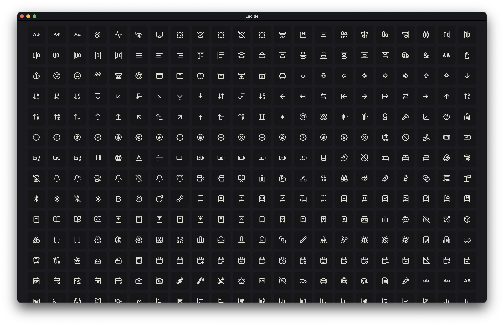

# Filament Lucide Icons

[](https://packagist.org/packages/codewithdennis/filament-lucide-icons)
[](https://github.com/codewithdennis/filament-lucide-icons/actions?query=workflow%3A"Fix+PHP+code+styling"+branch%3A4.x)
[](https://packagist.org/packages/codewithdennis/filament-lucide-icons)

A Filament `4.x` plugin that integrates **1647** [Lucide icons](https://lucide.dev/icons/), allowing you to use them seamlessly across Filament forms, tables, actions, and more.



## Installation

You can install the package via composer:

```bash
composer require codewithdennis/filament-lucide-icons
```

## Usage

```php
use CodeWithDennis\FilamentLucideIcons\Enums\LucideIcon;
```

```php
public static function configure(Schema $schema): Schema
{
    return $schema
        ->components([
            Forms\Components\TextInput::make('email')
                ->prefixIcon(LucideIcon::Mail)
                ->email()
                ->required();
        ]);
```

```php
final class UserResource extends Resource
{
    protected static string|BackedEnum|null $navigationIcon = LucideIcon::UsersRound;
}
```

## Contributing

Please see [CONTRIBUTING](.github/CONTRIBUTING.md) for details.

## Credits

- [CodeWithDennis](https://github.com/CodeWithDennis)
- [Mallardduck](https://github.com/mallardduck/blade-lucide-icons)
- [Lucide](https://lucide.dev/icons/)
- [All Contributors](../../contributors)

## License

The MIT License (MIT). Please see [License File](LICENSE.md) for more information.
